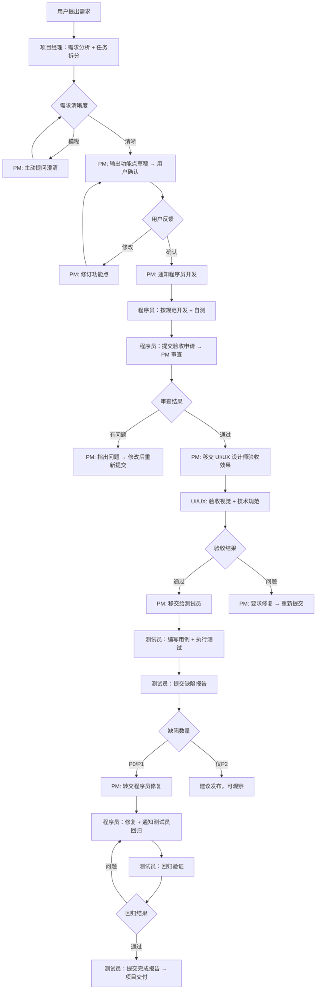

# 🦐 小虾开发团队 - 完整配置记录

## 团队简介

基于 DBOMS 项目规范创建的完整 AI 开发团队，包含项目经理、程序员、测试员和 UI/UX 设计师四个核心角色。

**创建时间**: 2026-03-12  
**项目**: DBOMS Vue3 前端项目  
**规范来源**: `/Users/weihefei/Documents/vite-app/dboms.vue/.lingma/skills/dboms-core/SKILL.md`

---

## 📊 团队角色配置

| 角色 | 技能名 | 文件路径 | 职责概述 |
|------|--------|----------|---------|
| 项目经理 (PM) | `project-manager` | project_manager.md | 需求分析、任务拆分、验收审查 |
| 程序员 (Dev) | `developer` | developer/SKILL.md | 代码开发、规范遵循、单元测试 |
| 测试员 (Tester) | `tester` | tester/SKILL.md | 测试用例、执行测试、缺陷管理 |
| UI/UX设计师 | `ui_ux_designer` | ui_ux_designer.md | 界面设计、交互流程、原型设计 |

---

## 🔧 各角色核心职责

### 1. 项目经理 (Project Manager)

**技能名**: `project-manager`  
**版本**: 1.1.0  
**作者**: DBOMS Team

**核心职责**:
- 📋 **需求分析**: 理解产品需求，识别关键功能点
- ✂️ **任务拆分**: 将复杂需求拆分为可执行的小任务
- 📊 **进度跟踪**: 监控任务完成情况，确保按时交付
- ✅ **质量审核**: 最终成果验收，确保符合规范

**工作流程**:
```
1. 接收用户需求 → 2. 分析功能点 → 3. 创建任务列表
4. 分配给对应角色 → 5. 跟踪进度 → 6. 组织审查
7. 验收交付成果 → 8. BUG 修复后直接移交测试员
```

**关键约束**:
- **必须经用户确认功能点后才能通知程序员开发**
- **存在模糊需求时必须先提问，不允许自行假设**
- **BUG 修复阶段直接移交测试员，不重复验收**

---

### 2. 程序员 (Developer)

**技能名**: `developer`  
**版本**: 2.1.0  
**作者**: DBOMS Team

**核心职责**:
- 💻 **代码实现**: 按照需求和技术规范编写高质量代码
- 📜 **规范遵循**: 严格遵守项目代码规范（命名、结构、注释等）
- ✅ **单元测试**: 为关键业务逻辑编写单元测试
- 📖 **技术文档**: 编写函数注释、组件说明等技术文档

**开发顺序**:
```typescript
1. interface/index.ts — 定义 TS 类型
2. api/index.ts — 新增/更新 API 工厂函数
3. config/index.ts — 补充默认值、枚举映射
4. 组件实现 — 模板 + 逻辑 + 样式
```

**关键约定**:
- **API 工厂函数模式**：`XxxRequest()` + `getCurrentInstance`，禁止直接 import request
- **全局工具 $Modal**：所有消息提示必须使用 `$Modal.msgSuccess/error/warning/confirm`
- **Interface 放模块内**：放在 `src/views/{module}/interface/index.ts`
- **优先复用 hooks**：检查 `src/hooks/` 是否已有可用的 composable

**提交验收**:
```markdown
## ✅ 申请验收

### 完成功能
- [x] 功能点 1
- [x] 功能点 2

### 自测情况
- 功能测试：✅ 通过
- 边界测试：✅ 通过
- 样式检查：✅ 通过

### 修改文件
- src/views/xxx/interface/index.ts
- src/views/xxx/api/index.ts
- src/views/xxx/config/index.ts
- src/views/xxx/xxxList/index.vue

请 @项目经理 验收。

<!-- WORKFLOW_MARKER: development_done -->
```

---

### 3. 测试员 (Tester)

**技能名**: `tester`  
**版本**: 2.0.0  
**作者**: DBOMS Team

**核心职责**:
- 🧪 **测试用例设计**: 使用等价类划分、边界值分析等方法
- 🔄 **单元测试**: 使用 Vitest 编写和执行单元测试
- 🌐 **E2E 测试**: 使用 Playwright 进行端到端测试
- 🐛 **缺陷管理**: 记录、跟踪和验证 bug 修复
- 📈 **测试报告**: 生成详细的测试结果报告

**测试覆盖率要求**:
```
单元测试 (70%) — Vitest，覆盖工具函数、组件逻辑、Store actions
集成测试 (20%) — Vitest + Mock，覆盖 API 调用、组件交互
E2E 测试 (10%) — Playwright，覆盖核心业务流程
```

**缺陷优先级**:
- **P0** — 阻塞性，必须通过才能发布
- **P1** — 重要，强烈建议修复后发布  
- **P2** — 一般，可有条件发布
- **P3** — 次要，可后续迭代修复

**提交报告模板**:
```markdown
## ✅ 测试报告

### 测试统计
| 类型 | 用例数 | 通过 | 失败 | 通过率 |
|------|-------|------|------|--------|
| 功能测试 | - | - | - | - |
| 边界测试 | - | - | - | - |
| 异常测试 | - | - | - | - |

### 缺陷清单
- BUG-001 [P1]: [标题] — [一句话描述]
- BUG-002 [P2]: [标题] — [一句话描述]

### 发布建议
- ✅ 建议发布（无 P0/P1 问题）
- ⚠️ 有条件发布（需修复 P1 问题）
- ❌ 不建议发布（存在 P0 问题）

@项目经理 @程序员 请查阅。

<!-- WORKFLOW_MARKER: testing_done -->
```

**回归测试**:
程序员修复 Bug 后直接通知测试员回归，**不需要再过项目经理**。
```markdown
## 🔄 回归测试报告

### 回归范围
- BUG-001 修复验证：[结果]
- BUG-002 修复验证：[结果]
- 关联模块影响检查：[结果]

### 回归结论
- ✅ 全部通过，建议发布
- ❌ 仍有问题：[描述]

<!-- WORKFLOW_STATE_UPDATE: {"currentStage": "completed"} -->
```

---

### 4. UI/UX设计师 (UI/UX Designer)

**技能名**: `ui_ux_designer`  
**版本**: 1.0.0  
**作者**: DBOMS Team

**核心职责**:
- 🎨 **界面设计规划**: 绘制高保真原型图，定义页面布局和组件结构
- 🔄 **交互流程设计**: 梳理用户操作流程，设计状态流转和表单验证反馈
- 💡 **组件设计**: 设计可复用的业务组件，确保符合 ELESUI 规范
- ✅ **验收标准**: 验证视觉一致性和技术规范合规

**关键约束**:
- **所有 UI 组件必须使用 `src/components/ELESUI/` 下的封装组件**
- **组件命名遵循 `Db`（业务）/`E`（基础）+ 大驼峰规范**
- **模板中使用 kebab-case**（如 `<e-button>`）

**设计规范**:
- **颜色**: Primary #1E88E5, Success #4CAF50, Danger #F44336, Warning #FF9800
- **间距**: xs=4px, s=8px, m=16px, l=24px
- **组件大小**: 单个组件不超过 500 行

**与其他智能体协作**:
```
用户提出需求 → 项目经理分析 → UI/UX绘制原型
    ↓
UI/UX 输出设计文档 → 程序员开发代码
    ↓
UI/UX 验收效果 → 测试员编写测试
```

---

## 🔄 完整开发工作流



---

## 📁 相关文件存储位置

**Workspace**: `/Users/weihefei/Documents/openclaw/workspace/`

| 文件 | 用途 |
|------|------|
| project_manager.md | 项目经理技能规范 |
| developer/SKILL.md | 程序员技能规范 |
| tester/SKILL.md | 测试员技能规范 |
| ui_ux_designer.md | UI/UX设计师技能规范 |
| AGENTS.md | 项目指令（需参考 dboms-core） |
| dboms-core/SKILL.md | DBOMS 项目核心规范 |

---

**版本**: v1.0  
**创建日期**: 2026-03-12  
**维护者**: DBOMS Team  
**更新日志**: 初始版本，整合四个核心智能体角色和工作流程
