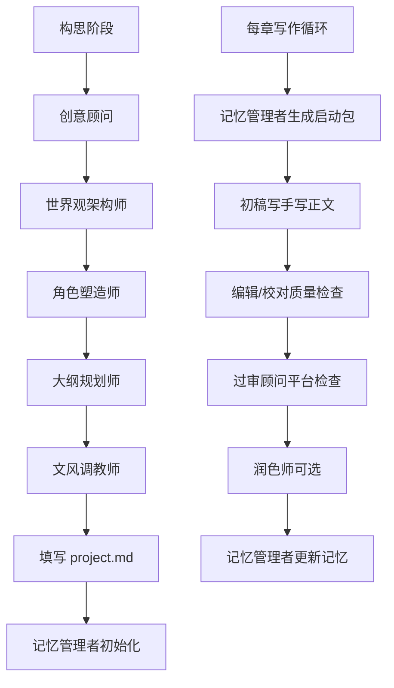

# 小说工作室 Skill

---

## 这个 Skill 是什么

把整套小说创作流程和智能体团队打包成一个随时可用的工作室。

**解决三个核心问题：**
1. 写了前章，后章忘记设定 → 记忆管理者维护事实数据库
2. 风格漂移 → 文风调教师制定规范，初稿写手严格遵守
3. 逻辑错误 → 编辑/校对 + 修订者双重把关

---

## 团队成员速查

| 成员 | 文件 | 一句话职能 | 触发词 |
|------|------|-----------|--------|
| 创意顾问 | `/workspace/agents/business-analyst.md` | 市场分析、核心卖点 | 市场、卖点、定位 |
| 世界观架构师 | `/workspace/agents/world-builder.md` | 构建世界观、设定体系 | 世界观、设定、体系 |
| 角色塑造师 | `/workspace/agents/character-builder.md` | 人物设计、性格、对话风格 | 角色、人物、人设 |
| 大纲规划师 | `/workspace/agents/outline-planner.md` | 整体结构、章节规划 | 大纲、结构、规划 |
| 文风调教师 | `/workspace/agents/style-tuner.md` | 制定文风规范 | 文风、风格、文笔 |
| 情节设计师 | `/workspace/agents/plot-designer.md` | 具体情节、冲突、高潮 | 情节、冲突、高潮 |
| 初稿写手 | `/workspace/agents/draft-writer.md` | 根据大纲写正文 | 写、创作、正文、初稿 |
| 编辑/校对 | `/workspace/agents/editor-proofreader.md` | 错别字、语病、逻辑漏洞 | 校对、检查、编辑 |
| 润色师 | `/workspace/agents/reviser.md` | 提升文笔、丰富表达 | 润色、优化、文笔 |
| 过审顾问 | `/workspace/agents/compliance-advisor.md` | 平台规则检查 | 过审、平台、审核 |
| 记忆管理者 | `/workspace/agents/memory-keeper.md` | 维护事实数据库、生成启动包 | 记忆、启动包、更新 |
| 悬疑专家 | `/workspace/agents/mystery-specialist.md` | 推理逻辑、悬念铺设 | 悬疑、推理、悬念 |
| 言情专家 | `/workspace/agents/romance-specialist.md` | 情感线、CP 互动 | 言情、感情、CP |
| 科幻专家 | `/workspace/agents/scifi-specialist.md` | 硬核设定、未来科技 | 科幻、未来、科技 |
| 仙侠专家 | `/workspace/agents/xianxia-specialist.md` | 修炼体系、灵宝秘境 | 仙侠、修炼、功法 |

---

## 能力 (Capabilities)

本 skill 提供以下小说创作能力:

- **市场分析**: 核心卖点提炼、市场定位分析
- **世界观构建**: 神话体系、修炼体系、社会结构
- **角色设计**: 人物性格、背景故事、对话风格
- **大纲规划**: 整体结构、章节规划、节奏把控
- **文风规范**: 风格定义、文笔调性
- **情节设计**: 冲突设置、高潮安排、转折点
- **正文创作**: 根据大纲和启动包创作章节
- **质量审查**: 错别字、语病、逻辑漏洞检查
- **文笔润色**: 提升表达、丰富细节
- **平台过审**: 规则检查、安全写法建议
- **记忆管理**: 事实数据库维护、章节启动包生成

## 工作流程 (Workflow)

### 场景一：写新章节

```bash
# 步骤 1: 生成章节启动包
skill: novel-studio/memory-keeper --action generate_context --chapter N

# 步骤 2: 创作正文
skill: novel-studio/draft-writer --action write --context context_第 N 章.md

# 步骤 3: 质量审查（可并行）
skill: novel-studio/editor-proofreader --action check --file 第 N 章_[标题].md
skill: novel-studio/reviser --action polish --file 第 N 章_[标题].md

# 步骤 4: 更新记忆
skill: novel-studio/memory-keeper --action update --chapter N
```

### 场景二：审查已有章节

```bash
# 文字和逻辑检查
skill: novel-studio/editor-proofreader --action check --file [文件名].md

# 文笔提升（可选）
skill: novel-studio/reviser --action polish --file [文件名].md
```

### 场景三：从零开始新项目

```bash
# 步骤 1: 市场分析
skill: novel-studio/business-analyst --action analyze

# 步骤 2: 世界观构建
skill: novel-studio/world-builder --action create

# 步骤 3: 角色设计
skill: novel-studio/character-builder --action design

# 步骤 4: 大纲规划
skill: novel-studio/outline-planner --action plan

# 步骤 5: 文风规范
skill: novel-studio/style-tuner --action define

# 步骤 6: 初始化记忆
skill: novel-studio/memory-keeper --action init
```

---

## 完整写作流程



---

## 项目文件结构

```
[项目目录]/
├── project.md              # 项目配置（必填）
├── 世界观设定.md
├── 人物卡.md
├── 大纲规划.md
├── 完整故事梗概.md
├── 文风规范_[风格].md
├── continuity/
│   └── fact_database.md    # 事实数据库（记忆核心）
└── chapters/
    ├── context_第 1 章.md    # 章节启动包
    ├── 第 1 章_[标题].md     # 章节正文
    └── ...
```

---

## 调用规则 (Rules)

1. **每个智能体启动前必须读取其配置文件**（`/workspace/agents/xxx.md`）
2. **不读文件，不开始工作**
3. 创作新章节：按顺序调用，不可跳步
4. 审查已有章节：编辑/校对 + 润色师可并行
5. 遇到设定冲突：暂停写作，先解决冲突，再继续

## 工具定义 (Tools)

本 skill 包含以下子工具:

| 工具名 | 功能 | 输入参数 | 输出 |
|--------|------|----------|------|
| `business-analyst` | 市场分析 | `--action analyze` | 市场定位报告 |
| `world-builder` | 世界观构建 | `--action create` | 世界观设定文档 |
| `character-builder` | 角色设计 | `--action design` | 人物卡 |
| `outline-planner` | 大纲规划 | `--action plan` | 大纲 + 故事梗概 |
| `style-tuner` | 文风规范 | `--action define` | 文风规范文档 |
| `draft-writer` | 正文创作 | `--action write --context [文件]` | 章节正文 |
| `editor-proofreader` | 质量审查 | `--action check --file [文件]` | 审查报告 |
| `reviser` | 文笔润色 | `--action polish --file [文件]` | 润色后的文稿 |
| `compliance-advisor` | 平台过审 | `--action review --file [文件]` | 过审建议 |
| `memory-keeper` | 记忆管理 | `--action init/generate_context/update` | 事实数据库/启动包 |

## 当前项目 (Current Projects)

| 项目 | 目录 | 状态 |
|------|------|------|
| 不老不死的我 | `novel/不老不死的我/` | 进行中（第15章已完成） |

---

## 参考文档

- 完整构思流程：`novel-system/workflows/01_构思阶段流程.md`
- 完整写作循环：`novel-system/workflows/02_写作阶段流程.md`
- 章节启动包模板：`novel-system/templates/context_chapter.md`
- 事实数据库模板：`novel-system/templates/fact_database.md`
- 项目配置模板：`novel-system/templates/project.md`
